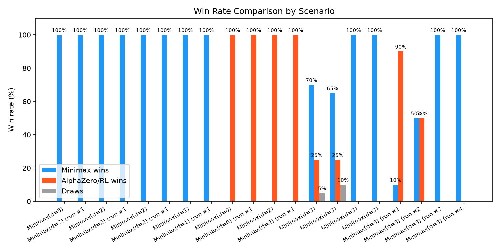
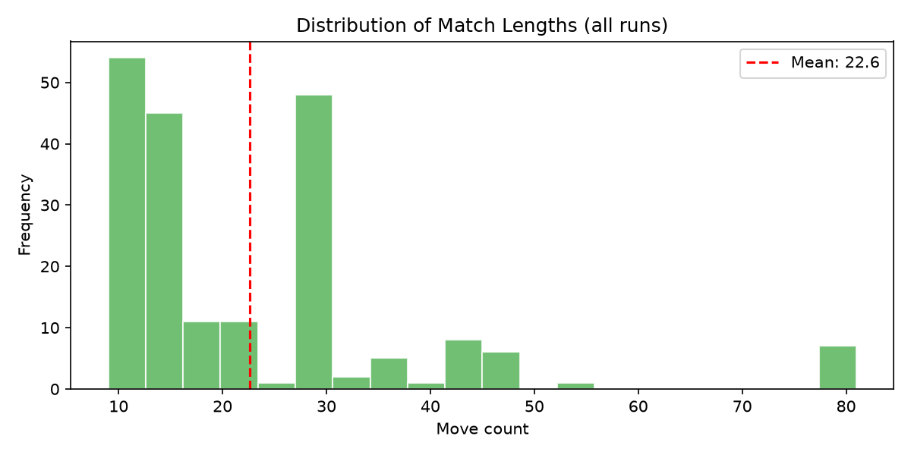
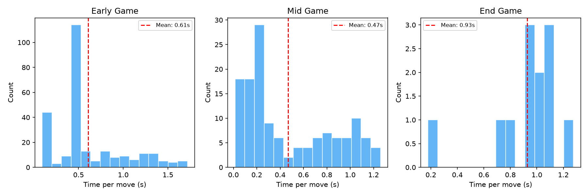
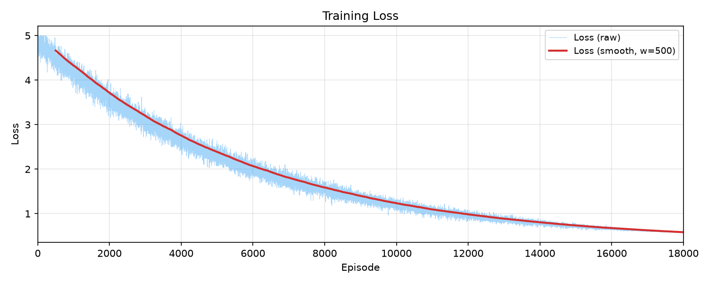
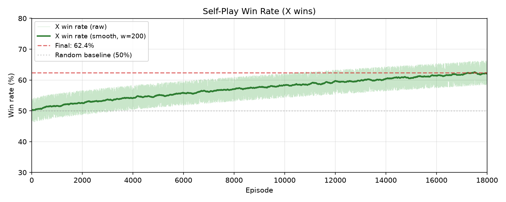
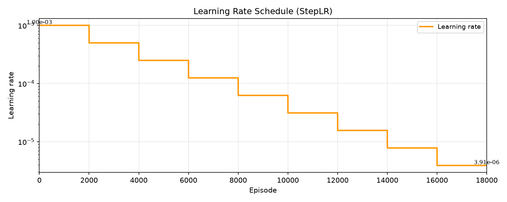
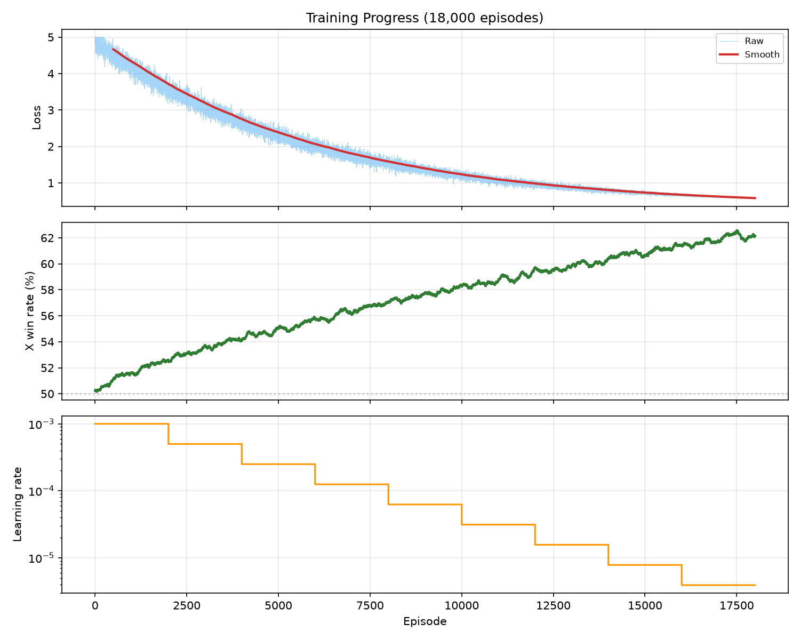

# Gomoku AI Agent

Project môn học AI so sánh hai hướng tiếp cận cho Gomoku 9×9:

- **Minimax + Alpha-Beta Pruning** (có iterative deepening, Zobrist hashing, transposition table)
- **AlphaZero-style Reinforcement Learning** (ResNet + MCTS self-play)

Project có GUI bằng Pygame, script train RL, benchmark, phân tích kết quả và sinh chart.

## Tech Stack

- Python 3.x · Pygame · NumPy · pandas · PyTorch · pytest

## Directory Layout

```text
src/
├── main.py                  # entrypoint — GUI
├── game/
│   ├── board.py             # 9×9 board
│   ├── rules.py             # win/draw detection
│   └── constants.py
├── ai/
│   ├── base.py              # abstract Agent
│   ├── heuristic.py         # evaluation function (pattern matching)
│   ├── threats.py           # 50-pattern tactical recognition
│   ├── minimax.py           # Minimax + Alpha-Beta
│   ├── mcts.py              # AlphaZero MCTS (PUCT, virtual loss)
│   └── rl_agent.py          # RLAgent + AlphaZeroAgent (ResNet)
├── ui/
│   ├── gui.py               # Pygame main loop
│   └── renderer.py          # board rendering + UI buttons
├── utils/
│   ├── logger.py            # CSV match log + JSONL replay
│   └── replay_buffer.py     # experience replay
└── scripts/
    ├── train_rl.py          # self-play training
    ├── compare.py           # Minimax vs AlphaZero/RL
    ├── bench.py             # nhanh benchmark nhiều combo
    ├── plot_training.py     # sinh chart từ match logs
    ├── plot_curves.py       # sinh training curves
    └── analyze_data.py      # thống kê matches / checkpoint / buffer
tests/                       # pytest (game logic, heuristic, minimax, mcts, ...)
assets/                      # charts (sims80/, sims120/)
models/                      # model checkpoints
logs/                        # matches.csv, replays.jsonl
colab_train.py               # standalone training script for Google Colab
```

## Cài đặt

```bash
pip install -r requirements.txt
```

## Cách chạy

### 1. GUI

```bash
python src/main.py
# hoặc
python -m src.main
```

Các chế độ: `hvh` (Human vs Human), `hvai` (Human vs AI), `aivai` (AI vs AI).

```bash
python src/main.py --mode hvai --ai minimax --depth 3
python src/main.py --mode hvai --ai alphazero --rl-model models/rl_agent.pth --mcts-sims 80
python src/main.py --mode aivai --ai alphazero --depth 3 --rl-model models/rl_agent.pth --mcts-sims 120
```

### 2. Train RL (local)

```bash
python src/scripts/train_rl.py
# hoặc
python -m src.scripts.train_rl
```

Các flag: `--episodes`, `--batch-size`, `--mcts-sims`, `--c-puct`, `--num-res-blocks`, `--channels`, `--resume`.

### 3. Compare Minimax vs AlphaZero

```bash
python src/scripts/compare.py --matches 100 --depth 3 --agent-type alphazero --rl-model models/rl_agent.pth --mcts-sims 120 --c-puct 1.4 --num-res-blocks 5 --channels 64
```

Flag quan trọng: `--agent-type {rl, alphazero}`, `--mcts-sims`, `--c-puct`, `--log-replay`.

### 4. Benchmark nhanh

```bash
python src/scripts/bench.py
```

Chạy nhiều combo sims/depth (vd: 20/2, 40/2, 60/2, 80/2, 80/3, 100/3, 80/4) mỗi combo 20 matches.

### 5. Sinh chart

```bash
# Tất cả chart so sánh + scenario detail
python src/scripts/plot_training.py

# Chỉ 1 scenario (vd: sims=120)
python src/scripts/plot_training.py --scenario "sims=120"

# Training curves (loss, win rate, LR)
python src/scripts/plot_curves.py
```

### 6. Phân tích dữ liệu

```bash
python src/scripts/analyze_data.py
python src/scripts/analyze_data.py --json   # output JSON
```

### 7. Chạy test

```bash
pytest tests/
```

### 8. Train trên Google Colab

Xem hướng dẫn chi tiết tại [`README_COLAB.md`](README_COLAB.md). Dùng `colab_train.py` — file standalone chứa toàn bộ Board, Rules, MCTS, Network, Agent.

---

## Kết quả so sánh: Minimax(d=3) vs AlphaZero

100 matches mỗi cấu hình, đổi bên luân phiên:

| Config | AlphaZero thắng | Minimax thắng | Hòa |
|---|---|---|---|
| **sims=80** (100 matches) | 16% | 82% | 2% |
| **sims=120** (100 matches) | 65% | 30% | 5% |

Nhận xét: **MCTS simulations càng cao → AlphaZero càng mạnh**. Từ 80 lên 120 simulations đã lật ngược tỷ lệ từ 16% → 65%. Khi AlphaZero đi trước (X) với sims=120, thắng tới 80%.

---

## Chart Gallery

### So sánh tổng quan

| Chart | Mô tả |
|---|---|
| [](assets/win_rate_comparison.png) | Tỷ lệ thắng Minimax vs AlphaZero (sims=80 vs sims=120) |
| [](assets/move_count_distribution.png) | Phân bố số nước đi mỗi trận |
| [](assets/thinking_time_distribution.png) | Thời gian suy nghĩ trung bình theo giai đoạn |

### Scenario detail: sims=80

| Run | Minimax (X) vs AlphaZero (O) | AlphaZero (X) vs Minimax (O) |
|---|---|---|
| Run 1 | [](assets/sims80/scenario_Minimaxd%3D3_vs_AlphaZerosims%3D80_run_%231.png) | [](assets/sims80/scenario_AlphaZerosims%3D80_vs_Minimaxd%3D3_run_%231.png) |
| Run 2 | [](assets/sims80/scenario_Minimaxd%3D3_vs_AlphaZerosims%3D80_run_%232.png) | [](assets/sims80/scenario_AlphaZerosims%3D80_vs_Minimaxd%3D3_run_%232.png) |
| Run 3 | [](assets/sims80/scenario_Minimaxd%3D3_vs_AlphaZerosims%3D80_run_%233.png) | [](assets/sims80/scenario_AlphaZerosims%3D80_vs_Minimaxd%3D3_run_%233.png) |

### Scenario detail: sims=120

| Run | Minimax (X) vs AlphaZero (O) | AlphaZero (X) vs Minimax (O) |
|---|---|---|
| Run 1 | [](assets/sims120/scenario_Minimaxd%3D3_vs_AlphaZerosims%3D120_run_%231.png) | [](assets/sims120/scenario_AlphaZerosims%3D120_vs_Minimaxd%3D3_run_%231.png) |
| Run 2 | [](assets/sims120/scenario_Minimaxd%3D3_vs_AlphaZerosims%3D120_run_%232.png) | [](assets/sims120/scenario_AlphaZerosims%3D120_vs_Minimaxd%3D3_run_%232.png) |
| Run 3 | [](assets/sims120/scenario_Minimaxd%3D3_vs_AlphaZerosims%3D120_run_%233.png) | [](assets/sims120/scenario_AlphaZerosims%3D120_vs_Minimaxd%3D3_run_%233.png) |

### Training curves (18,000 episodes self-play)

| Chart | Mô tả |
|---|---|
| [](assets/training_loss_curve.png) | Loss giảm dần qua các episode |
| [](assets/training_win_rate_curve.png) | Win rate của X (cuối: 62.4%) |
| [](assets/training_lr_curve.png) | Learning rate schedule (StepLR) |
| [](assets/training_combined.png) | Gộp 3 đồ thị trên 1 hình |

---

## Code Conventions

- **Style:** PEP 8 (`black` formatter, `ruff` linter)
- **Naming:** `snake_case` cho hàm/biến, `PascalCase` cho class, `UPPER_CASE` cho hằng
- **Typing:** type hints trên mọi function signature
- **Docstrings:** Google-style cho public functions và classes

## Commit Convention

- `feat:` — new feature
- `fix:` — bug fix
- `refactor:` — code restructure
- `test:` — add/update tests
- `docs:` — documentation
- `train:` — RL training experiments

## Ghi chú

- Board là **9×9** (không phải 15×15 như reference repo) — RL phải train lại từ đầu.
- RL training cần GPU (CUDA) cho tốc độ thực tế; CPU fallback chậm.
- Heuristic evaluation cân bằng offense (xây pattern) và defense (chặn đối thủ).
- Match logging ghi lại: winner, move count, avg thinking time theo stage (early/mid/end).
