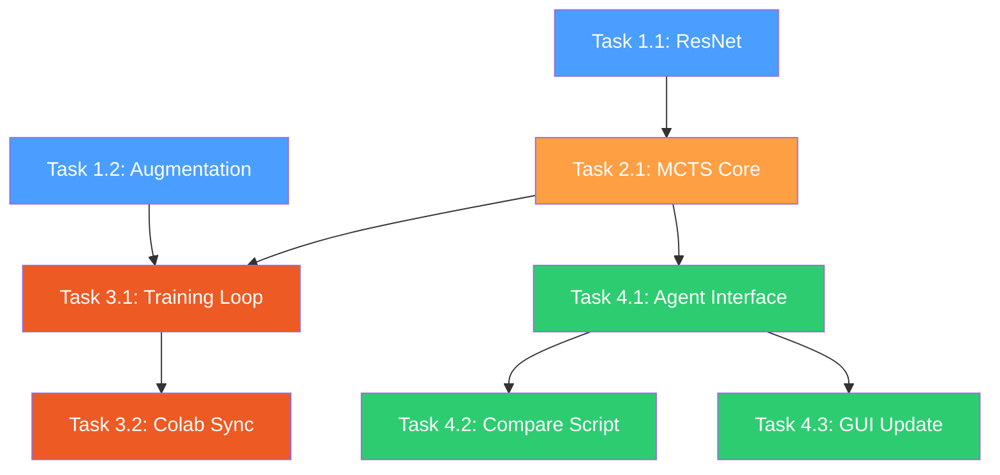

# Kế hoạch nâng cấp RL Agent → AlphaZero

## Tổng quan

Nâng cấp RL Agent từ CNN 3 lớp + Epsilon-Greedy thành **AlphaZero** (ResNet + MCTS).  
Tư tưởng cốt lõi: **MCTS giả lập suy nghĩ sâu, ResNet đánh giá trực giác.**

> [!CAUTION]
> **Chi phí tính toán cao.** Mỗi nước đi cần chạy hàng trăm mô phỏng MCTS qua mạng Neural.
> - **Colab (GPU):** Khả thi, ước tính ~2-4h cho 1000 ván self-play.
> - **Inference (đấu thực):** Giới hạn MCTS simulations = 100-400 để giữ thời gian suy nghĩ < 3 giây.

---

## Danh sách file bị ảnh hưởng

| File | Hành động | Mô tả |
|------|-----------|-------|
| `src/ai/rl_agent.py` | **MODIFY** | Thay `GomokuNet` → `ResNet`, thêm augmentation, thêm `AlphaZeroAgent` |
| `src/ai/mcts.py` | **NEW** | Thuật toán MCTS + PUCT |
| `src/scripts/train_rl.py` | **MODIFY** | Bỏ Epsilon-Greedy, dùng MCTS self-play pipeline |
| `colab_train.py` | **MODIFY** | Đồng bộ kiến trúc ResNet + logic MCTS self-play |
| `src/scripts/compare.py` | **MODIFY** | Hỗ trợ `AlphaZeroAgent` + tham số MCTS simulations |
| `src/ai/base.py` | GIỮ NGUYÊN | Interface `Agent` không đổi |
| `src/ui/gui.py` | **MODIFY** | Nhập và sử dụng `AlphaZeroAgent` |

---

## Phase 1: Kiến trúc ResNet + Data Augmentation

### Task 1.1 — ResNet Network

**File:** `src/ai/rl_agent.py`  
**Status:** ⬜ Chưa bắt đầu

Thay thế `GomokuNet` (3 lớp Conv2D đơn giản) bằng `AlphaZeroNet` (ResNet):

```python
class ResidualBlock(nn.Module):
    """2 lớp Conv2D + BatchNorm + skip connection."""
    def __init__(self, channels: int = 64) -> None:
        super().__init__()
        self.conv1 = nn.Conv2d(channels, channels, 3, padding=1)
        self.bn1 = nn.BatchNorm2d(channels)
        self.conv2 = nn.Conv2d(channels, channels, 3, padding=1)
        self.bn2 = nn.BatchNorm2d(channels)

    def forward(self, x: torch.Tensor) -> torch.Tensor:
        residual = x
        x = torch.relu(self.bn1(self.conv1(x)))
        x = self.bn2(self.conv2(x))
        x += residual  # skip connection
        return torch.relu(x)


class AlphaZeroNet(nn.Module):
    def __init__(
        self,
        board_size: int = BOARD_SIZE,
        num_res_blocks: int = 5,
        channels: int = 64,
    ) -> None:
        super().__init__()
        # Input: 3 channels (player, opponent, empty)
        self.input_conv = nn.Sequential(
            nn.Conv2d(3, channels, 3, padding=1),
            nn.BatchNorm2d(channels),
            nn.ReLU(),
        )
        self.res_blocks = nn.Sequential(
            *[ResidualBlock(channels) for _ in range(num_res_blocks)]
        )
        # Policy head: xác suất nước đi
        self.policy_head = nn.Sequential(
            nn.Conv2d(channels, 2, 1),
            nn.BatchNorm2d(2),
            nn.ReLU(),
            nn.Flatten(),
            nn.Linear(2 * board_size * board_size, board_size * board_size),
        )
        # Value head: đánh giá thắng/thua [-1, 1]
        self.value_head = nn.Sequential(
            nn.Conv2d(channels, 1, 1),
            nn.BatchNorm2d(1),
            nn.ReLU(),
            nn.Flatten(),
            nn.Linear(board_size * board_size, 64),
            nn.ReLU(),
            nn.Linear(64, 1),
            nn.Tanh(),
        )

    def forward(self, x):
        x = self.input_conv(x)
        x = self.res_blocks(x)
        policy = self.policy_head(x)
        value = self.value_head(x)
        return policy, value
```

**Lưu ý quan trọng:**
- Giữ lại class `GomokuNet` cũ (đổi tên thành `GomokuNetLegacy`) để có thể load model cũ khi so sánh.
- `AlphaZeroNet` có cùng interface (input 3 channels, output policy + value) → tương thích replay buffer hiện tại.
- Số `num_res_blocks=5` phù hợp cho bàn 9x9 (nhỏ hơn 15x15 nên không cần 19 blocks như AlphaGo).

**Acceptance criteria:**
- [ ] `AlphaZeroNet` xuất ra policy shape `(batch, 81)` và value shape `(batch, 1)`
- [ ] Forward pass chạy không lỗi với input shape `(1, 3, 9, 9)`

---

### Task 1.2 — Data Augmentation

**File:** `src/ai/rl_agent.py`  
**Status:** ⬜ Chưa bắt đầu  
**Phụ thuộc:** Không

Thêm hàm `augment_data()` sinh 8 phiên bản đối xứng (4 phép xoay x 2 lật) từ 1 cặp `(state, policy)`:

```python
def augment_data(
    state: np.ndarray,   # shape (3, 9, 9)
    policy: np.ndarray,  # shape (81,)
) -> list[tuple[np.ndarray, np.ndarray]]:
    """Sinh 8 phiên bản đối xứng của trạng thái bàn cờ.

    Biến đổi: identity, rot90, rot180, rot270, flip-h, flip-h+rot90,
              flip-h+rot180, flip-h+rot270.
    """
    board_size = state.shape[1]
    policy_2d = policy.reshape(board_size, board_size)
    augmented = []

    for k in range(4):  # 0, 90, 180, 270
        s_rot = np.rot90(state, k, axes=(1, 2)).copy()
        p_rot = np.rot90(policy_2d, k).copy().flatten()
        augmented.append((s_rot, p_rot))

        # Lật ngang + xoay
        s_flip = np.flip(s_rot, axis=2).copy()
        p_flip = np.fliplr(np.rot90(policy_2d, k)).copy().flatten()
        augmented.append((s_flip, p_flip))

    return augmented
```

**Acceptance criteria:**
- [ ] `augment_data` trả về đúng 8 cặp `(state, policy)`
- [ ] Bàn cờ đối xứng khớp với policy (quân ở (0,0) -> policy bit tương ứng ở vị trí đã xoay/lật)
- [ ] Unit test kiểm tra: đặt 1 quân ở (0, 0), augment, verify vị trí chính xác trong cả 8 biến thể

---

## Phase 2: Thuật toán MCTS

### Task 2.1 — MCTS Core

**File:** `src/ai/mcts.py` *(file mới)*  
**Status:** ⬜ Chưa bắt đầu  
**Phụ thuộc:** Task 1.1 (cần `AlphaZeroNet` để đánh giá lá)

Cài đặt **Monte Carlo Tree Search** với **PUCT selection**:

```
PUCT(s, a) = Q(s,a) + c_puct * P(s,a) * sqrt(N(s)) / (1 + N(s,a))
```

Trong đó:
- `Q(s,a)` — giá trị trung bình của nhánh
- `P(s,a)` — prior probability từ policy head của network
- `N(s)` — tổng lượt thăm node cha
- `N(s,a)` — lượt thăm nhánh con
- `c_puct = 1.5` (hệ số exploration, có thể tune)

**Cấu trúc class:**

```python
class MCTSNode:
    """Node trong cây MCTS."""
    state: np.ndarray          # grid hiện tại
    player: int                # người chơi tiếp theo
    parent: MCTSNode | None
    children: dict[tuple[int, int], MCTSNode]
    visit_count: int           # N(s)
    value_sum: float           # tổng W cho Q = W/N
    prior: float               # P(s,a) từ network


class MCTS:
    """AlphaZero-style MCTS."""

    def __init__(
        self,
        network: AlphaZeroNet,
        device: str = "cpu",
        num_simulations: int = 200,
        c_puct: float = 1.5,
        temperature: float = 1.0,
    ) -> None: ...

    def search(self, root_state: np.ndarray, player: int) -> np.ndarray:
        """Trả về phân bố xác suất pi trên toàn bộ 81 ô.

        Quy trình mỗi simulation:
        1. SELECT — đi từ root xuống lá theo PUCT
        2. EXPAND — tạo children cho node lá, gọi network lấy P(s,a)
        3. EVALUATE — lấy value V(s) từ network
        4. BACKPROPAGATE — cập nhật Q, N ngược lên root
        """
        ...
        # Tính pi từ visit counts
        # Nếu temperature > 0: pi(a) = N(a)^(1/T) / sum(N(b)^(1/T))
        # Nếu temperature == 0: pi = argmax(N)
```

**Lưu ý hiệu năng:**
- Trên bàn 9x9 với 200 simulations, mỗi nước đi mất ~0.3-1 giây trên GPU, ~2-5 giây trên CPU.
- Không cần virtual loss (chỉ chạy single-threaded cho đơn giản).
- Cache policy/value prediction của root node để tránh gọi network lại.

**Acceptance criteria:**
- [ ] `MCTS.search()` trả về vector `pi` shape `(81,)` với tổng xấp xỉ 1.0
- [ ] Các ô đã có quân có `pi[i] == 0`
- [ ] Smoke test: tạo board trống, chạy 50 simulations -> nước đi ở trung tâm (4,4) có `pi` cao nhất

---

## Phase 3: Nâng cấp Self-Play Training

### Task 3.1 — Training Loop mới

**File:** `src/scripts/train_rl.py`  
**Status:** ⬜ Chưa bắt đầu  
**Phụ thuộc:** Task 1.1, Task 1.2, Task 2.1

Thay đổi chính so với code hiện tại:

| Hiện tại | AlphaZero mới |
|----------|---------------|
| Epsilon-Greedy (đi random một tỷ lệ) | MCTS search -> phân bố `pi` |
| Policy target = one-hot (nước thực tế) | Policy target = `pi` (cả phân bố) |
| Không augment dữ liệu | Augment 8x mỗi ván |
| Giữ `GomokuNet` | Dùng `AlphaZeroNet` |

**Quy trình self-play 1 ván:**

```
1. Khởi tạo board trống, current_player = X
2. Lặp cho đến khi game over:
   a. Gọi MCTS.search(state, player) -> pi (phân bố 81 ô)
   b. Nếu move_count < EXPLORATION_MOVES (vd: 12):
      - Chọn nước đi random theo phân bố pi (temperature=1.0)
   c. Ngược lại:
      - Chọn nước đi max(pi) (temperature->0, deterministic)
   d. Lưu (state, pi) vào trajectory
   e. Đặt quân, kiểm tra win/draw
3. Sau ván: gán reward (+1/-1/0) cho từng state
4. Augment: sinh 8 biến thể cho mỗi (state, pi, reward)
5. Đẩy toàn bộ vào replay buffer
6. Train step trên batch random từ buffer
```

**Thay đổi CLI:**

| Flag cũ | Thay đổi |
|---------|----------|
| `--epsilon` | **Bỏ** (không còn epsilon-greedy) |
| `--epsilon-decay` | **Bỏ** |
| *(mới)* `--mcts-sims` | Số simulations MCTS (mặc định: 200) |
| *(mới)* `--c-puct` | Hệ số exploration PUCT (mặc định: 1.5) |
| *(mới)* `--exploration-moves` | Số nước đầu dùng temperature=1 (mặc định: 12) |

**Acceptance criteria:**
- [ ] Self-play 1 ván hoàn thành không crash
- [ ] Replay buffer chứa states được augment 8x
- [ ] Loss giảm dần sau 50+ ván

---

### Task 3.2 — Đồng bộ Colab Training

**File:** `colab_train.py`  
**Status:** ⬜ Chưa bắt đầu  
**Phụ thuộc:** Task 3.1

Vì `colab_train.py` là bản **self-contained** (gộp tất cả code vào 1 file để chạy trên Colab), cần đồng bộ:

- Copy `AlphaZeroNet` (thay `GomokuNet`) vào section Neural Network
- Copy `MCTS` + `MCTSNode` vào section mới "MCTS"
- Copy `augment_data` vào section mới "Data Augmentation"
- Cập nhật `play_self_play_game` -> dùng MCTS thay Epsilon-Greedy
- Cập nhật CLI: bỏ `--epsilon-start/end`, thêm `--mcts-sims`, `--c-puct`
- Cập nhật `validate_agent`: dùng MCTS với ít simulations (50) khi validate

**Acceptance criteria:**
- [ ] `colab_train.py` chạy standalone trên Colab (không import gì từ `src/`)
- [ ] Model output tương thích — có thể load bằng `RLAgent.load()` trên local

---

## Phase 4: Tích hợp và Kiểm thử

### Task 4.1 — Cập nhật Agent Interface

**File:** `src/ai/rl_agent.py`  
**Status:** ⬜ Chưa bắt đầu  
**Phụ thuộc:** Task 2.1

Tạo class `AlphaZeroAgent(Agent)` (giữ `RLAgent` cũ):

```python
class AlphaZeroAgent(Agent):
    def __init__(
        self,
        device: str = "cpu",
        num_simulations: int = 200,
        c_puct: float = 1.5,
        ...
    ) -> None:
        self.network = AlphaZeroNet().to(device)
        self.mcts = MCTS(self.network, device, num_simulations, c_puct)
        ...

    def get_move(self, grid: np.ndarray, player: int) -> tuple[int, int]:
        """Dùng MCTS để chọn nước đi (temperature=0, deterministic)."""
        pi = self.mcts.search(grid, player)
        # Mask invalid moves
        valid_mask = (grid.flatten() == EMPTY)
        pi = pi * valid_mask
        move_idx = int(np.argmax(pi))
        return move_idx // BOARD_SIZE, move_idx % BOARD_SIZE
```

**Lưu ý:** Giữ cả `RLAgent` (class cũ dùng `GomokuNet`) để có thể so sánh RL cũ vs AlphaZero mới.

**Acceptance criteria:**
- [ ] `AlphaZeroAgent.get_move()` trả về nước đi hợp lệ
- [ ] Load model trained -> đấu 1 ván GUI không crash
- [ ] Signature tương thích `Agent.get_move(grid, player)`

---

### Task 4.2 — Cập nhật Compare Script

**File:** `src/scripts/compare.py`  
**Status:** ⬜ Chưa bắt đầu  
**Phụ thuộc:** Task 4.1

Bổ sung tham số:

```
--agent-type {minimax,rl,alphazero}  # chọn agent 2
--mcts-sims 200                       # MCTS simulations cho AlphaZero
```

Cho phép so sánh 3 cặp:
- Minimax vs RL (cũ)
- Minimax vs AlphaZero (mới)
- RL (cũ) vs AlphaZero (mới)

**Acceptance criteria:**
- [ ] `python src/scripts/compare.py --agent-type alphazero --rl-model models/rl_agent.pth --matches 5` chạy được
- [ ] Log kết quả vào `logs/matches.csv` đúng format

---

### Task 4.3 — Cập nhật GUI

**File:** `src/ui/gui.py` và `src/main.py`  
**Status:** ⬜ Chưa bắt đầu  
**Phụ thuộc:** Task 4.1

Cho người dùng chọn đối thủ AI trong GUI hoặc qua CLI:

```
python src/main.py --ai alphazero --model models/rl_agent.pth --mcts-sims 200
```

**Acceptance criteria:**
- [ ] Người chơi đấu được với AlphaZero Agent qua GUI
- [ ] AI suy nghĩ < 5 giây/nước đi (200 sims trên CPU)

---

## Open Questions

> [!IMPORTANT]
> Cần quyết định trước khi code:

1. **Tách class hay ghi đè?** Tạo `AlphaZeroAgent` riêng (khuyến nghị) hay sửa trực tiếp `RLAgent`?
   - **Khuyến nghị:** Tạo class mới `AlphaZeroAgent` — giữ bản cũ để dễ so sánh A/B test.

2. **Số MCTS simulations mặc định?** 200 (inference) / 400 (training)?
   - 200 sims đủ tốt cho 9x9. Training có thể tăng lên 400 nếu GPU đủ mạnh.

3. **Temperature schedule:** Dùng temperature=1.0 cho bao nhiêu nước đầu?
   - Theo chuẩn AlphaZero: 30 nước đầu cho bàn 19x19. Bàn 9x9 -> giảm xuống ~10-15 nước.

---

## Verification Plan

### Automated Tests

| Test | Mô tả | File |
|------|--------|------|
| `test_augmentation` | Augment 1 state -> 8 biến thể, verify vị trí quân chính xác | `tests/test_augmentation.py` |
| `test_mcts_basic` | Tạo board trống, chạy 50 sims -> nước đi hợp lệ ở trung tâm | `tests/test_mcts.py` |
| `test_mcts_winning_move` | Board sắp thắng -> MCTS phải chọn nước thắng | `tests/test_mcts.py` |
| `test_resnet_forward` | `AlphaZeroNet` forward pass shapes đúng | `tests/test_rl_agent.py` |
| `test_alphazero_agent_interface` | `AlphaZeroAgent.get_move()` trả về ô hợp lệ | `tests/test_rl_agent.py` |

### Manual Verification

1. **Smoke test GPU:** Chạy self-play 2 ván trên Colab -> không crash bộ nhớ
2. **Training convergence:** Chạy 500 ván -> loss giảm, validation win rate vs random > 80%
3. **Agent comparison:** `compare.py`: Minimax(d=3) vs AlphaZero(200 sims) x 20 ván -> ghi nhận kết quả
4. **GUI test:** Đấu thử 1 ván qua GUI -> AI phản hồi < 5 giây, game hoàn thành bình thường

---

## Thứ tự thực hiện



**Song song được:** Task 1.1 và Task 1.2 (không phụ thuộc nhau).
