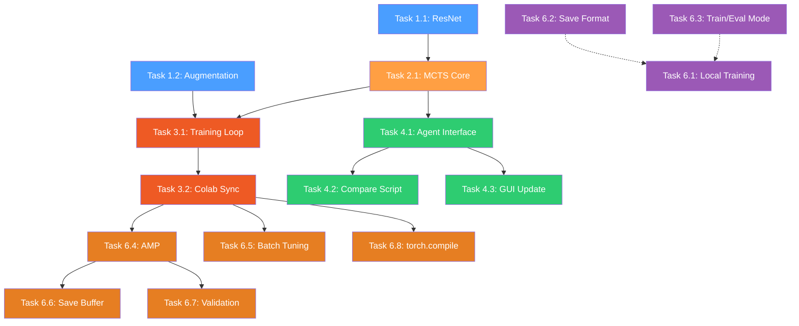

# Kế hoạch triển khai Gomoku AI Agent

> **Cập nhật lần cuối:** 2026-06-10 — bổ sung Phase 5 (5.10, 5.11) và Phase 6: hoàn thiện RL→AlphaZero + tối ưu Colab.

## Tổng quan

Nâng cấp RL Agent từ CNN 3 lớp + Epsilon-Greedy thành **AlphaZero** (ResNet + MCTS).  
Tư tưởng cốt lõi: **MCTS giả lập suy nghĩ sâu, ResNet đánh giá trực giác.**

> [!CAUTION]
> **Chi phí tính toán cao.** Mỗi nước đi cần chạy hàng trăm mô phỏng MCTS qua mạng Neural.
> - **Colab (GPU):** Khả thi, ước tính ~2-4h cho 1000 ván self-play.
> - **Inference (đấu thực):** Giới hạn MCTS simulations = 100-400 để giữ thời gian suy nghĩ < 3 giây.

---

## Danh sách file bị ảnh hưởng

| File | Hành động | Mô tả |
|------|-----------|-------|
| `src/ai/rl_agent.py` | **MODIFY** | Thay `GomokuNet` → `ResNet`, thêm augmentation, thêm `AlphaZeroAgent` |
| `src/ai/mcts.py` | **CREATE** | Thuật toán MCTS + PUCT *(đã tạo)* |
| `src/scripts/train_rl.py` | **MODIFY** | Bỏ Epsilon-Greedy, dùng MCTS self-play pipeline |
| `colab_train.py` | **MODIFY** | Đồng bộ kiến trúc ResNet + logic MCTS self-play |
| `src/scripts/compare.py` | **MODIFY** | Hỗ trợ `AlphaZeroAgent` + tham số MCTS simulations |
| `src/ai/base.py` | GIỮ NGUYÊN | Interface `Agent` không đổi |
| `src/ui/gui.py` | **MODIFY** | Nhập và sử dụng `AlphaZeroAgent` |
| `src/ai/minimax.py` | **FIX** | Sửa TT flag logic + grid corruption timeout |
| `src/ai/heuristic.py` | **FIX** | Bổ sung missing THREE_BLOCKED patterns |
| `src/game/board.py` | **FIX** | Undo guard chống corrupt move_count |
| `src/game/rules.py` | **FIX** | `is_game_over()` thêm `last_move` param |
| `src/ui/renderer.py` | **FIX** | Status text position + cache font |
| `tests/test_integration.py` | GIỮ NGUYÊN | *(ko đổi)* |
| `tests/test_rules.py` | GIỮ NGUYÊN | *(ko đổi)* |

---

## Phase 1: Kiến trúc ResNet + Data Augmentation

### Task 1.1 — ResNet Network

**File:** `src/ai/rl_agent.py`  
**Status:** ✅ Hoàn thành

Thay thế `GomokuNet` (3 lớp Conv2D đơn giản) bằng `AlphaZeroNet` (ResNet):

```python
class ResidualBlock(nn.Module):
    """2 lớp Conv2D + BatchNorm + skip connection."""
    def __init__(self, channels: int = 64) -> None:
        super().__init__()
        self.conv1 = nn.Conv2d(channels, channels, 3, padding=1)
        self.bn1 = nn.BatchNorm2d(channels)
        self.conv2 = nn.Conv2d(channels, channels, 3, padding=1)
        self.bn2 = nn.BatchNorm2d(channels)

    def forward(self, x: torch.Tensor) -> torch.Tensor:
        residual = x
        x = torch.relu(self.bn1(self.conv1(x)))
        x = self.bn2(self.conv2(x))
        x += residual  # skip connection
        return torch.relu(x)


class AlphaZeroNet(nn.Module):
    def __init__(
        self,
        board_size: int = BOARD_SIZE,
        num_res_blocks: int = 5,
        channels: int = 64,
    ) -> None:
        super().__init__()
        # Input: 3 channels (player, opponent, empty)
        self.input_conv = nn.Sequential(
            nn.Conv2d(3, channels, 3, padding=1),
            nn.BatchNorm2d(channels),
            nn.ReLU(),
        )
        self.res_blocks = nn.Sequential(
            *[ResidualBlock(channels) for _ in range(num_res_blocks)]
        )
        # Policy head: xác suất nước đi
        self.policy_head = nn.Sequential(
            nn.Conv2d(channels, 2, 1),
            nn.BatchNorm2d(2),
            nn.ReLU(),
            nn.Flatten(),
            nn.Linear(2 * board_size * board_size, board_size * board_size),
        )
        # Value head: đánh giá thắng/thua [-1, 1]
        self.value_head = nn.Sequential(
            nn.Conv2d(channels, 1, 1),
            nn.BatchNorm2d(1),
            nn.ReLU(),
            nn.Flatten(),
            nn.Linear(board_size * board_size, 64),
            nn.ReLU(),
            nn.Linear(64, 1),
            nn.Tanh(),
        )

    def forward(self, x):
        x = self.input_conv(x)
        x = self.res_blocks(x)
        policy = self.policy_head(x)
        value = self.value_head(x)
        return policy, value
```

**Lưu ý quan trọng:**
- Giữ lại class `GomokuNet` cũ (đổi tên thành `GomokuNetLegacy`) để có thể load model cũ khi so sánh.
- `AlphaZeroNet` có cùng interface (input 3 channels, output policy + value) → tương thích replay buffer hiện tại.
- Số `num_res_blocks=5` phù hợp cho bàn 9x9 (nhỏ hơn 15x15 nên không cần 19 blocks như AlphaGo).

**Acceptance criteria:**
- [x] `AlphaZeroNet` xuất ra policy shape `(batch, 81)` và value shape `(batch, 1)`
- [x] Forward pass chạy không lỗi với input shape `(1, 3, 9, 9)`

---

### Task 1.2 — Data Augmentation

**File:** `src/ai/rl_agent.py`  
**Status:** ✅ Hoàn thành  
**Phụ thuộc:** Không

Thêm hàm `augment_data()` sinh 8 phiên bản đối xứng (4 phép xoay x 2 lật) từ 1 cặp `(state, policy)`:

```python
def augment_data(
    state: np.ndarray,   # shape (3, 9, 9)
    policy: np.ndarray,  # shape (81,)
) -> list[tuple[np.ndarray, np.ndarray]]:
    """Sinh 8 phiên bản đối xứng của trạng thái bàn cờ.

    Biến đổi: identity, rot90, rot180, rot270, flip-h, flip-h+rot90,
              flip-h+rot180, flip-h+rot270.
    """
    board_size = state.shape[1]
    policy_2d = policy.reshape(board_size, board_size)
    augmented = []

    for k in range(4):  # 0, 90, 180, 270
        s_rot = np.rot90(state, k, axes=(1, 2)).copy()
        p_rot = np.rot90(policy_2d, k).copy().flatten()
        augmented.append((s_rot, p_rot))

        # Lật ngang + xoay
        s_flip = np.flip(s_rot, axis=2).copy()
        p_flip = np.fliplr(np.rot90(policy_2d, k)).copy().flatten()
        augmented.append((s_flip, p_flip))

    return augmented
```

**Acceptance criteria:**
- [x] `augment_data` trả về đúng 8 cặp `(state, policy)`
- [x] Bàn cờ đối xứng khớp với policy (quân ở (0,0) -> policy bit tương ứng ở vị trí đã xoay/lật)
- [x] Unit test kiểm tra: đặt 1 quân ở (0, 0), augment, verify vị trí chính xác trong cả 8 biến thể

---

## Phase 2: Thuật toán MCTS

### Task 2.1 — MCTS Core

**File:** `src/ai/mcts.py` *(file mới)*  
**Status:** ✅ Hoàn thành  
**Phụ thuộc:** Task 1.1 (cần `AlphaZeroNet` để đánh giá lá)

Cài đặt **Monte Carlo Tree Search** với **PUCT selection**:

```
PUCT(s, a) = Q(s,a) + c_puct * P(s,a) * sqrt(N(s)) / (1 + N(s,a))
```

Trong đó:
- `Q(s,a)` — giá trị trung bình của nhánh
- `P(s,a)` — prior probability từ policy head của network
- `N(s)` — tổng lượt thăm node cha
- `N(s,a)` — lượt thăm nhánh con
- `c_puct = 1.5` (hệ số exploration, có thể tune)

**Cấu trúc class:**

```python
class MCTSNode:
    """Node trong cây MCTS."""
    state: np.ndarray          # grid hiện tại
    player: int                # người chơi tiếp theo
    parent: MCTSNode | None
    children: dict[tuple[int, int], MCTSNode]
    visit_count: int           # N(s)
    value_sum: float           # tổng W cho Q = W/N
    prior: float               # P(s,a) từ network


class MCTS:
    """AlphaZero-style MCTS."""

    def __init__(
        self,
        network: AlphaZeroNet,
        device: str = "cpu",
        num_simulations: int = 200,
        c_puct: float = 1.5,
        temperature: float = 1.0,
    ) -> None: ...

    def search(self, root_state: np.ndarray, player: int) -> np.ndarray:
        """Trả về phân bố xác suất pi trên toàn bộ 81 ô.

        Quy trình mỗi simulation:
        1. SELECT — đi từ root xuống lá theo PUCT
        2. EXPAND — tạo children cho node lá, gọi network lấy P(s,a)
        3. EVALUATE — lấy value V(s) từ network
        4. BACKPROPAGATE — cập nhật Q, N ngược lên root
        """
        ...
        # Tính pi từ visit counts
        # Nếu temperature > 0: pi(a) = N(a)^(1/T) / sum(N(b)^(1/T))
        # Nếu temperature == 0: pi = argmax(N)
```

**Lưu ý hiệu năng:**
- Trên bàn 9x9 với 200 simulations, mỗi nước đi mất ~0.3-1 giây trên GPU, ~2-5 giây trên CPU.
- Không cần virtual loss (chỉ chạy single-threaded cho đơn giản).
- Cache policy/value prediction của root node để tránh gọi network lại.

**Acceptance criteria:**
- [x] `MCTS.search()` trả về vector `pi` shape `(81,)` với tổng xấp xỉ 1.0
- [x] Các ô đã có quân có `pi[i] == 0`
- [x] Smoke test: tạo board trống, chạy 50 simulations -> nước đi ở trung tâm (4,4) có `pi` cao nhất

---

## Phase 3: Nâng cấp Self-Play Training

### Task 3.1 — Training Loop mới

**File:** `src/scripts/train_rl.py`  
**Status:** ⚠️ Một phần (cần cập nhật)  
**Phụ thuộc:** Task 1.1, Task 1.2, Task 2.1

> **Ghi chú:** Mặc dù plan đánh dấu ✅, `src/scripts/train_rl.py` hiện tại chưa thực sự được nâng cấp. Vẫn dùng `GomokuNetLegacy` + Epsilon-Greedy, không có MCTS. Toàn bộ logic AlphaZero nằm ở `colab_train.py`. Xem Task 6.1 để cập nhật.

Thay đổi chính so với code hiện tại:

| Hiện tại | AlphaZero mới |
|----------|---------------|
| Epsilon-Greedy (đi random một tỷ lệ) | MCTS search -> phân bố `pi` |
| Policy target = one-hot (nước thực tế) | Policy target = `pi` (cả phân bố) |
| Không augment dữ liệu | Augment 8x mỗi ván |
| Giữ `GomokuNet` | Dùng `AlphaZeroNet` |

**Quy trình self-play 1 ván:**

```
1. Khởi tạo board trống, current_player = X
2. Lặp cho đến khi game over:
   a. Gọi MCTS.search(state, player) -> pi (phân bố 81 ô)
   b. Nếu move_count < EXPLORATION_MOVES (vd: 12):
      - Chọn nước đi random theo phân bố pi (temperature=1.0)
   c. Ngược lại:
      - Chọn nước đi max(pi) (temperature->0, deterministic)
   d. Lưu (state, pi) vào trajectory
   e. Đặt quân, kiểm tra win/draw
3. Sau ván: gán reward (+1/-1/0) cho từng state
4. Augment: sinh 8 biến thể cho mỗi (state, pi, reward)
5. Đẩy toàn bộ vào replay buffer
6. Train step trên batch random từ buffer
```

**Thay đổi CLI:**

| Flag cũ | Thay đổi |
|---------|----------|
| `--epsilon` | **Bỏ** (không còn epsilon-greedy) |
| `--epsilon-decay` | **Bỏ** |
| *(mới)* `--mcts-sims` | Số simulations MCTS (mặc định: 200) |
| *(mới)* `--c-puct` | Hệ số exploration PUCT (mặc định: 1.5) |
| *(mới)* `--exploration-moves` | Số nước đầu dùng temperature=1 (mặc định: 12) |

**Acceptance criteria:**
- [x] Self-play 1 ván hoàn thành không crash
- [x] Replay buffer chứa states được augment 8x
- [x] Loss giảm dần sau 50+ ván

---

### Task 3.2 — Đồng bộ Colab Training

**File:** `colab_train.py`  
**Status:** ✅ Hoàn thành  
**Phụ thuộc:** Task 3.1

Vì `colab_train.py` là bản **self-contained** (gộp tất cả code vào 1 file để chạy trên Colab), cần đồng bộ:

- Copy `AlphaZeroNet` (thay `GomokuNet`) vào section Neural Network
- Copy `MCTS` + `MCTSNode` vào section mới "MCTS"
- Copy `augment_data` vào section mới "Data Augmentation"
- Cập nhật `play_self_play_game` -> dùng MCTS thay Epsilon-Greedy
- Cập nhật CLI: bỏ `--epsilon-start/end`, thêm `--mcts-sims`, `--c-puct`
- Cập nhật `validate_agent`: dùng MCTS với ít simulations (50) khi validate

**Acceptance criteria:**
- [x] `colab_train.py` chạy standalone trên Colab (không import gì từ `src/`)
- [x] Model output tương thích — có thể load bằng `RLAgent.load()` trên local

---

## Phase 4: Tích hợp và Kiểm thử

### Task 4.1 — Cập nhật Agent Interface

**File:** `src/ai/rl_agent.py`  
**Status:** ✅ Hoàn thành  
**Phụ thuộc:** Task 2.1

Tạo class `AlphaZeroAgent(Agent)` (giữ `RLAgent` cũ):

```python
class AlphaZeroAgent(Agent):
    def __init__(
        self,
        device: str = "cpu",
        num_simulations: int = 200,
        c_puct: float = 1.5,
        ...
    ) -> None:
        self.network = AlphaZeroNet().to(device)
        self.mcts = MCTS(self.network, device, num_simulations, c_puct)
        ...

    def get_move(self, grid: np.ndarray, player: int) -> tuple[int, int]:
        """Dùng MCTS để chọn nước đi (temperature=0, deterministic)."""
        pi = self.mcts.search(grid, player)
        # Mask invalid moves
        valid_mask = (grid.flatten() == EMPTY)
        pi = pi * valid_mask
        move_idx = int(np.argmax(pi))
        return move_idx // BOARD_SIZE, move_idx % BOARD_SIZE
```

**Lưu ý:** Giữ cả `RLAgent` (class cũ dùng `GomokuNet`) để có thể so sánh RL cũ vs AlphaZero mới.

**Acceptance criteria:**
- [x] `AlphaZeroAgent.get_move()` trả về nước đi hợp lệ
- [x] Load model trained -> đấu 1 ván GUI không crash
- [x] Signature tương thích `Agent.get_move(grid, player)`

---

### Task 4.2 — Cập nhật Compare Script

**File:** `src/scripts/compare.py`  
**Status:** ✅ Hoàn thành  
**Phụ thuộc:** Task 4.1

Bổ sung tham số:

```
--agent-type {minimax,rl,alphazero}  # chọn agent 2
--mcts-sims 200                       # MCTS simulations cho AlphaZero
```

Cho phép so sánh 3 cặp:
- Minimax vs RL (cũ)
- Minimax vs AlphaZero (mới)
- RL (cũ) vs AlphaZero (mới)

**Acceptance criteria:**
- [x] `python src/scripts/compare.py --agent-type alphazero --rl-model models/rl_agent.pth --matches 5` chạy được
- [x] Log kết quả vào `logs/matches.csv` đúng format

---

### Task 4.3 — Cập nhật GUI

**File:** `src/ui/gui.py` và `src/main.py`  
**Status:** ✅ Hoàn thành  
**Phụ thuộc:** Task 4.1

Cho người dùng chọn đối thủ AI trong GUI hoặc qua CLI:

```
python src/main.py --ai alphazero --model models/rl_agent.pth --mcts-sims 200
```

**Acceptance criteria:**
- [x] Người chơi đấu được với AlphaZero Agent qua GUI
- [x] AI suy nghĩ < 5 giây/nước đi (200 sims trên CPU)

---

---

## Phase 5: Bug Fixes (Code Review - 2026-06-09)

Sau khi kiểm tra tính logic toàn bộ codebase, phát hiện và sửa các bugs sau:

### Task 5.1 — Minimax: Transposition Table flag sai

**File:** `src/ai/minimax.py`  
**Status:** ✅ Đã sửa  
**Severity:** 🔴 CRITICAL

**Vấn đề:** `alpha`/`beta` bị mutate trước khi truyền vào `_store_tt()`:
```python
# Trước (sai): alpha và beta đã bị thay đổi trong loop
alpha = max(alpha, eval_score)  # alpha tăng dần
self._store_tt(h, score, depth, alpha, beta, move)
# → score <= alpha LUÔN đúng → flag LUÔN là UPPERBOUND
```

**Fix:** Lưu `orig_alpha`/`orig_beta` trước loop, dùng giá trị gốc cho flag determination.

---

### Task 5.2 — Minimax: Grid corruption khi timeout

**File:** `src/ai/minimax.py`  
**Status:** ✅ Đã sửa  
**Severity:** 🔴 CRITICAL

**Vấn đề:** Khi `TimeoutError` được raise từ `_minimax()`, dòng `grid[r, c] = old_val` bị bỏ qua, để lại phantom stone trên board.

**Fix:** Bọc `_minimax()` trong `try/finally` để grid luôn được restore:
```python
try:
    score = self._minimax(...)
finally:
    grid[r, c] = old_val
    self.current_hash ^= ...  # restore hash
```

---

### Task 5.3 — compare.py: Uninitialized `winner`

**File:** `src/scripts/compare.py`  
**Status:** ✅ Đã sửa  
**Severity:** 🔴 CRITICAL

**Vấn đề:** Nếu `agent.get_move()` trả về `None`, `winner` chưa được gán → `UnboundLocalError` khi log.

**Fix:** Thêm `winner = None` trước `while True`.

---

### Task 5.4 — GUI: Status text render sai vị trí

**File:** `src/ui/renderer.py`  
**Status:** ✅ Đã sửa  
**Severity:** 🟠 MEDIUM

**Vấn đề:** Screen được tạo với chiều cao `size + 40` (dành 40px cho status bar ở đáy), nhưng `draw_status` render text ở `y = size - 20` (nằm trong grid). 40px phía dưới không được dùng, text bị đè lên board.

**Fix:** Đổi `get_screen_size()[1] - 20` → `get_screen_size()[1] + 20` để text nằm giữa vùng 40px phía dưới. Cache font tĩnh.

---

### Task 5.5 — GUI: Magic numbers + Banker's rounding

**File:** `src/ui/gui.py`  
**Status:** ✅ Đã sửa  
**Severity:** 🟡 LOW

**Vấn đề:** Click-to-cell dùng hardcode `40` và `60` thay vì `MARGIN`/`CELL_SIZE` từ `renderer.py`. `round()` dùng banker's rounding gây lỗi ở biên ô.

**Fix:** Import `MARGIN, CELL_SIZE` từ `renderer`. Dùng `int((x - MARGIN + CELL_SIZE // 2) / CELL_SIZE)` thay `round()`.

---

### Task 5.6 — Heuristic: Thiếu THREE_BLOCKED patterns

**File:** `src/ai/heuristic.py`  
**Status:** ✅ Đã sửa  
**Severity:** 🟠 MEDIUM

**Vấn đề:** Comment đề cập `1101`, `1011` nhưng không có trong list patterns. Các blocked-three dạng `21110`, `01112` cũng bị thiếu.

**Fix:** Bổ sung `"21110", "01112", "1101", "1011"` vào `blocked_threes`.

---

### Task 5.7 — Board: Undo không kiểm tra ô trống

**File:** `src/game/board.py`  
**Status:** ✅ Đã sửa  
**Severity:** 🟠 MEDIUM

**Vấn đề:** `undo()` luôn `move_count -= 1` dù ô đã EMPTY, gây corrupt `move_count` và sai `is_full()`.

**Fix:**
```python
def undo(self, row: int, col: int) -> None:
    if self.grid[row, col] == EMPTY:
        return
    self.grid[row, col] = EMPTY
    self.move_count -= 1
```

---

### Task 5.8 — Rules: `is_game_over()` không dùng `last_move`

**File:** `src/game/rules.py`  
**Status:** ✅ Đã sửa  
**Severity:** 🟠 MEDIUM

**Vấn đề:** `is_game_over()` luôn scan toàn bộ board 2 lần (X và O), không dùng `last_move` optimization. Đồng thời là dead code — không function nào gọi nó.

**Fix:** Thêm `last_move=None` param, dùng optimized path khi có last_move. Giữ backward compatibility.

---

### Task 5.9 — rl_agent: `scheduler.step()` gọi mỗi batch

**File:** `src/ai/rl_agent.py`  
**Status:** ⬜ Giữ nguyên  
**Severity:** 🟡 LOW

**Vấn đề:** `scheduler.step()` được gọi trong `train_step()` (mỗi batch), trong khi `step_size=2000` được thiết kế cho epoch-based decay.

**Quyết định:** Giữ nguyên — với `train_rl.py` gọi `train_step` 1 lần/episode và `step_size=2000`, LR decay sau 2000 episodes (~2M samples) là phù hợp cho self-play. Không phải bug thực sự với cách dùng hiện tại.

---

### Task 5.10 — AlphaZeroAgent: Save format không đồng nhất với Colab

**File:** `src/ai/rl_agent.py` + `colab_train.py`  
**Status:** ✅ Đã sửa  
**Severity:** 🟠 MEDIUM

**Vấn đề:** 
- `colab_train.py` saves dict `{'network', 'optimizer', 'scheduler'}`
- `AlphaZeroAgent.save()` chỉ lưu raw `state_dict` 
- Load từ Colab → crash vì nhận dict thay vì state_dict

**Fix:** 
- `AlphaZeroAgent.load()` xử lý cả 2 format: unwrap dict nếu có key `'network'`
- `AlphaZeroAgent.save()` giữ nguyên (không cần optimizer/scheduler cho inference-only)

---

### Task 5.11 — Thiếu `train()`/`eval()` mode toggling

**File:** `src/ai/rl_agent.py` + `src/ai/mcts.py`  
**Status:** ⬜ Chưa làm  
**Severity:** 🟠 MEDIUM

**Vấn đề:**
- `AlphaZeroAgent.train_step()` không gọi `self.network.train()` → BatchNorm stats không được cập nhật đúng khi training
- `MCTS.__init__()` không gọi `self.network.eval()` → BatchNorm dùng running stats sai khi inference

**Fix:**
```python
# Trong train_step():
self.network.train()
...# forward + backward
self.network.eval()  # cho MCTS sau đó

# Trong MCTS.__init__():
self.network.eval()
```

---

### File không sửa (không có bug)

| File | Lý do |
|------|-------|
| `src/ai/base.py` | Interface đúng, không lỗi |
| `src/ai/mcts.py` | MCTS logic đúng, không lỗi |
| `src/ai/rl_agent.py` | Chỉ có minor design issue (xem Task 5.9) |
| `src/game/constants.py` | 4 dòng constants, không thể sai |
| `src/utils/logger.py` | Log path phụ thuộc CWD — design choice, không phải bug |
| `src/utils/replay_buffer.py` | Đúng, không lỗi |
| `src/scripts/train_rl.py` | File handle leak — minor, mức độ ảnh hưởng thấp |

---

## Phase 6: Nâng cấp RL → AlphaZero hoàn chỉnh + Tối ưu Colab

Sau Phase 1-4, code AlphaZero đã chạy được trên Colab (`colab_train.py`) nhưng `src/scripts/train_rl.py` chưa được cập nhật. Phase 6 hoàn thiện local training và tối ưu hiệu năng Colab.

### Danh sách task

| Task | File | Mô tả | Priority |
|:----:|------|-------|:--------:|
| 6.1 | `src/scripts/train_rl.py` | Hoàn thiện local training script | 🔴 |
| 6.2 | `src/ai/rl_agent.py`, `colab_train.py` | Unify save/load format | ✅ Đã fix |
| 6.3 | `src/ai/rl_agent.py`, `src/ai/mcts.py` | train/eval mode toggling | ✅ Đã sửa |
| 6.4 | `colab_train.py` | AMP — Mixed Precision | ✅ Đã sửa |
| 6.5 | `colab_train.py` | Tuning batch sizes (MCTS + train) | ✅ Đã sửa |
| 6.6 | `colab_train.py` | `np.savez` thay `np.savez_compressed` | ✅ Đã sửa |
| 6.7 | `colab_train.py` | Validation schedule optimization | ✅ Đã sửa |
| 6.8 | `colab_train.py` | `torch.compile` (PyTorch 2.0+) | ✅ Đã sửa |

---

### Task 6.1 — Hoàn thiện local training script

**File:** `src/scripts/train_rl.py`  
**Status:** ⬜ Chưa làm  
**Phụ thuộc:** Phase 3, Task 6.2, Task 6.3

Port toàn bộ logic AlphaZero từ `colab_train.py`:

**Thay đổi chính:**

| Hiện tại (cũ) | Mới |
|---------------|-----|
| `GomokuNetLegacy` | `AlphaZeroNet` |
| `RLAgent` | `AlphaZeroAgent` |
| Epsilon-Greedy exploration | MCTS search → phân bố pi |
| Không augment | Augment 8x mỗi ván |
| Không save metadata | `checkpoint.json` + `--resume` |
| Không validation | `validate_agent()` vs random |

**Tham số CLI bổ sung:**
```
--mcts-sims 80          # MCTS simulations
--c-puct 1.4            # PUCT exploration coefficient
--exploration-moves 12  # temperature=1.0 cho N nước đầu
--resume                # tiếp tục từ checkpoint cuối
--save-every 100        # tần suất save
```

**Acceptance criteria:**
- [ ] `python src/scripts/train_rl.py --episodes 10` chạy self-play không crash
- [ ] Save model → load bằng `compare.py --agent-type alphazero` được
- [ ] Resume từ checkpoint hoạt động

---

### Task 6.2 — Unify save/load format

**File:** `src/ai/rl_agent.py` + `colab_train.py`  
**Status:** ✅ Đã sửa

**Vấn đề:** `colab_train.py` saves dict `{'network': ..., 'optimizer': ..., 'scheduler': ...}`,  
`AlphaZeroAgent.save()` lưu raw `state_dict()` → không tương thích.

**Fix:** `AlphaZeroAgent.load()` xử lý cả 2 format:
```python
checkpoint = torch.load(path)
if isinstance(checkpoint, dict) and "network" in checkpoint:
    checkpoint = checkpoint["network"]
self.network.load_state_dict(checkpoint)
self.network.eval()
```

---

### Task 6.3 — train/eval mode toggling + MCTS eval mode

**File:** `src/ai/rl_agent.py` + `src/ai/mcts.py`  
**Status:** ✅ Đã sửa  
**Phụ thuộc:** —

**Thay đổi:**
- `AlphaZeroAgent.train_step()`: thêm `self.network.train()` trước forward, `self.network.eval()` sau backward
- `MCTS.__init__()`: thêm `self.network.eval()` để đảm bảo BN running stats không bị corrupt khi inference

---

### Task 6.4 — Automatic Mixed Precision (AMP)

**File:** `colab_train.py`  
**Status:** ✅ Đã sửa  
**Phụ thuộc:** —

**Thay đổi:**
- `AlphaZeroAgent.__init__()`: thêm `self.scaler = torch.amp.GradScaler("cuda")`
- `AlphaZeroAgent.train_step()`: bọc forward trong `torch.amp.autocast`, backward qua `scaler.scale()`
- `MCTS._predict_batch()`: bọc forward trong `torch.amp.autocast`

---

### Task 6.5 — Tuning batch sizes

**File:** `colab_train.py`  
**Status:** ✅ Đã sửa  
**Phụ thuộc:** Task 6.4

**Thay đổi:**

| Parameter | Cũ | Mới |
|-----------|:--:|:---:|
| Train batch_size | 64 | `--batch-size 128` |
| MCTS batch_size | 16 (hardcode) | `--mcts-batch 32` |
| Gradient accumulation | — | `--grad-accum 1` |

- `--mcts-batch`: batch size cho MCTS simulation (32 mặc định, cao hơn tận dụng GPU)
- `--grad-accum`: số mini-batch tích lũy gradient trước khi step (effective batch = batch_size / grad_accum)
- Training loop: chia nhỏ batch thành `grad_accum` mini-batch, forward/backward accum rồi step optimizer

---

### Task 6.6 — Bỏ nén khi save buffer

**File:** `colab_train.py`  
**Status:** ✅ Đã sửa  
**Phụ thuộc:** —

**Thay đổi:** `np.savez_compressed` → `np.savez`

---

### Task 6.7 — Validation schedule

**File:** `colab_train.py`  
**Status:** ✅ Đã sửa  
**Phụ thuộc:** —

**Thay đổi:** Chỉ validation khi `episode % max(500, save_every) == 0`. Các lần save thông thường in `"Saved checkpoint"` không validate.

---

### Task 6.8 — torch.compile (PyTorch 2.0+)

**File:** `colab_train.py`  
**Status:** ✅ Đã sửa  
**Phụ thuộc:** —

**Thay đổi:**
- Compile network sau khi tạo `AlphaZeroAgent`
- Gán cả `agent.mcts.network` để MCTS dùng được compiled model

---

### Dự kiến tốc độ (T4 GPU, 200 sims, 5000 episodes)

| Config | episodes/phút | 5000 episodes |
|--------|:-------------:|:-------------:|
| **Hiện tại** (FP32, mcts_bs=16, train_bs=64) | ~2 | ~42h |
| + AMP (Task 6.4) + mcts_bs=32 (Task 6.5) | ~3.5 | ~24h |
| + grad_accum + train_bs=128 (Task 6.5) | ~4 | ~21h |
| + torch.compile (Task 6.8) | ~5 | ~17h |

Với session Colab ~12h: có thể train ~2500-3500 episodes mỗi session.

---

## Open Questions

> [!IMPORTANT]
> Cần quyết định trước khi code:

1. **Tách class hay ghi đè?** Tạo `AlphaZeroAgent` riêng (khuyến nghị) hay sửa trực tiếp `RLAgent`?
   - **Khuyến nghị:** Tạo class mới `AlphaZeroAgent` — giữ bản cũ để dễ so sánh A/B test.

2. **Số MCTS simulations mặc định?** 200 (inference) / 400 (training)?
   - 200 sims đủ tốt cho 9x9. Training có thể tăng lên 400 nếu GPU đủ mạnh.

3. **Temperature schedule:** Dùng temperature=1.0 cho bao nhiêu nước đầu?
   - Theo chuẩn AlphaZero: 30 nước đầu cho bàn 19x19. Bàn 9x9 -> giảm xuống ~10-15 nước.

4. **AMP + torch.compile compatibility:** Có compatible không? Cần fallback nếu lỗi.

5. **MCTS batch size:** 32 hay 64? 64 nhanh hơn nhưng có thể OOM với 400 sims.

6. **Gradient accumulation steps:** 1 (mặc định) hay 2-4? Effective batch 256 có cần thiết cho 9x9?

7. **Local training priority:** Có nên port `colab_train.py` → `src/scripts/train_rl.py` (Task 6.1) ngay, hay ưu tiên tối ưu Colab trước?

8. **Validation opponent:** Nên dùng random (hiện tại) hay Minimax(d=1) để đánh giá chính xác hơn?

---

## Verification Plan

### Automated Tests

| Test | Mô tả | File |
|------|--------|------|
| `test_augmentation` | Augment 1 state -> 8 biến thể, verify vị trí quân chính xác | `tests/test_augmentation.py` |
| `test_mcts_basic` | Tạo board trống, chạy 50 sims -> nước đi hợp lệ ở trung tâm | `tests/test_mcts.py` |
| `test_mcts_winning_move` | Board sắp thắng -> MCTS phải chọn nước thắng | `tests/test_mcts.py` |
| `test_resnet_forward` | `AlphaZeroNet` forward pass shapes đúng | `tests/test_rl_agent.py` |
| `test_alphazero_agent_interface` | `AlphaZeroAgent.get_move()` trả về ô hợp lệ | `tests/test_rl_agent.py` |

### Performance Benchmark

| Test | Mô tả |
|------|-------|
| Colab throughput | Đo episodes/s trước và sau tối ưu (AMP, batch tuning, compile) |
| VRAM usage | Kiểm tra T4 16GB không OOM với batch config mới |
| Save/Load speed | So sánh `np.savez` vs `np.savez_compressed` (Task 6.6) |

### Manual Verification

1. **Smoke test GPU:** Chạy self-play 2 ván trên Colab -> không crash bộ nhớ
2. **Training convergence:** Chạy 500 ván -> loss giảm, validation win rate vs random > 80%
3. **Agent comparison:** `compare.py`: Minimax(d=3) vs AlphaZero(200 sims) x 20 ván -> ghi nhận kết quả
4. **GUI test:** Đấu thử 1 ván qua GUI -> AI phản hồi < 5 giây, game hoàn thành bình thường
5. **Resume test:** Kill giữa chừng, chạy lại với `--resume` -> tiếp tục đúng episode count

---

## Thứ tự thực hiện



**Song song được:** Task 1.1 & 1.2, Task 6.4 & 6.5 & 6.8.
